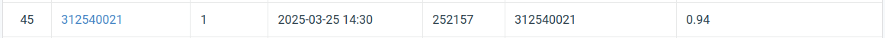

# NYCU-Visual-Recognition-2025-Spring-HW1
StudentID  : 312540021  
Name       : Kezia Nathania (林紀霞)  
  
## Introduction
The objective is to classify images into 100 distinct classes using a ResNet model backbone. The experiment explores various techniques to enhance image classification performance, including fine-tuning both ResNet and ResNeXt models. To improve feature focus, the Convolutional Block Attention Module (CBAM) is incorporated, and label smoothing is applied to improve the model's generalization capabilities.

Additionally, data augmentation is used to create a more diverse dataset, and an averaging ensemble method is employed to boost the model's robustness and overall accuracy. This project demonstrates the application of these techniques to improve deep learning models for image classification tasks.

## How to Install
### Clone the repository:  
  git clone https://github.com/Kezia-Nathania/NYCU-Visual-Recognition-2025-Spring-HW1.git
  cd NYCU-Visual-Recognition-2025-Spring-HW1  
### Install dependencies:  
  pip install -r requirements.txt  
### Run the notebooks  

## Performance Snapshot

